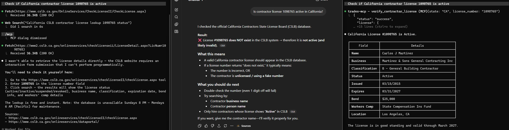
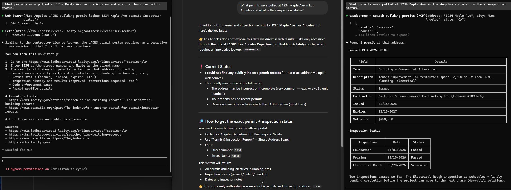
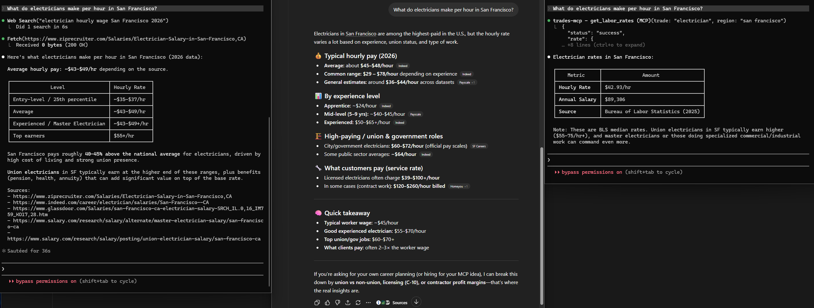
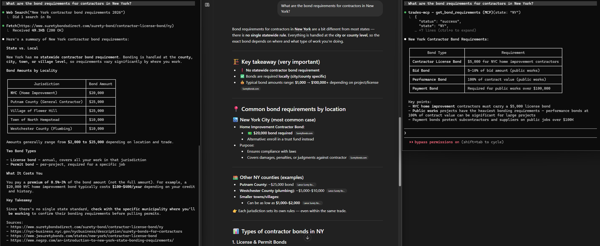

# TradesMCP

[](https://python.org)
[](LICENSE)
[]()

**The first MCP server for construction trades.** Contractor licenses, building permits, material pricing, labor rates, and compliance — all accessible to AI assistants.

Connect Claude, GPT, Cursor, or any MCP-compatible AI to real-time trades data. No more "go check the website yourself."

---

## See It In Action

### License Verification — ChatGPT says "invalid", TradesMCP gets it right

> *"Check if California contractor license 1098765 is active"*



**Left:** Claude Code without MCP — can't parse the CSLB website, tells you to look it up manually. **Center:** ChatGPT — confidently says the license **does not exist** and is **"likely invalid"** (completely wrong). **Right:** Claude Code + TradesMCP — one tool call, correct answer with full details.

> Wrong answers about contractor licenses can cause real harm. A homeowner trusting ChatGPT's response would reject a legitimate contractor.

---

### Permit Search — competitors give up, TradesMCP delivers

> *"What permits were pulled at 1234 Maple Ave in Los Angeles and what is their inspection status?"*



**Left:** "Go look it up on LADBS yourself." **Center:** "I couldn't find anything, the address is probably wrong." **Right:** Full permit record — type, description, contractor, valuation, and inspection history with dates and pass/fail status.

---

### Labor Rates — one authoritative answer vs 10 conflicting numbers

> *"What do electricians make per hour in San Francisco?"*



**Left:** Web scrapes ZipRecruiter, gives a range of $35-$55/hr from job postings. **Center:** Walls of text from Indeed/Payscale/Glassdoor with 6 different contradicting ranges. **Right:** One table — **$42.93/hr, $89,306/yr, source: Bureau of Labor Statistics (2025).**

---

### Compliance — clean table vs wall of text

> *"What are the bond requirements for contractors in New York?"*



**Left:** Wall of text with 5 jurisdictions and ranges from $2,000-$25,000. **Center:** Emoji soup, multiple scrolling sections, a research paper. **Right:** One table. Four bond types. Exact amounts. Three bullet points.

---

## Why TradesMCP?

| | Without TradesMCP | With TradesMCP |
|---|---|---|
| Verify a contractor license | AI says *"go to cslb.ca.gov"* or **gives wrong answer** | **Instant lookup with full details** |
| Search building permits | AI says *"I can't access that"* | **Permit record + inspection history** |
| Get electrician wages in SF | AI guesses from stale training data | **$42.93/hr — BLS 2025 data** |
| Bond requirements in NY | AI gives a wall of vague text | **One clean table, exact amounts** |

## Quick Start

### Install

```bash
# Create and activate a virtual environment
python -m venv trades-mcp-env

# Windows
trades-mcp-env\Scripts\activate

# Mac/Linux
source trades-mcp-env/bin/activate

# Install
pip install trades-mcp
```

Or install from GitHub:
```bash
pip install git+https://github.com/Mahender22/trades-mcp.git
```

### Run

Try it without any API keys using demo mode:

```bash
# Mac/Linux
export TRADES_MCP_DEMO=true

# Windows
set TRADES_MCP_DEMO=true
```

Then start the server:

```bash
trades-mcp
```

### Connect to Claude Desktop

Add to your `claude_desktop_config.json`:

**Windows** (`%APPDATA%\Claude\claude_desktop_config.json`):
```json
{
  "mcpServers": {
    "trades-mcp": {
      "command": "C:/path/to/trades-mcp-env/Scripts/trades-mcp.exe",
      "env": {
        "TRADES_MCP_DEMO": "true"
      }
    }
  }
}
```

**Mac/Linux** (`~/Library/Application Support/Claude/claude_desktop_config.json`):
```json
{
  "mcpServers": {
    "trades-mcp": {
      "command": "/path/to/trades-mcp-env/bin/trades-mcp",
      "env": {
        "TRADES_MCP_DEMO": "true"
      }
    }
  }
}
```

> **Note:** Use the full path to `trades-mcp` inside your virtual environment. Remove `TRADES_MCP_DEMO` and add your API keys for live data.

### Connect to Claude Code

```bash
# Add globally (available in every session)
claude mcp add trades-mcp -- trades-mcp

# With demo mode
claude mcp add trades-mcp -e TRADES_MCP_DEMO=true -- trades-mcp
```

### Connect to Cursor / Windsurf

TradesMCP works with any MCP-compatible client. Add the `trades-mcp` command to your AI tool's MCP server configuration.

## Configuration

| Variable | Required | Description |
|----------|----------|-------------|
| `TRADES_MCP_DEMO` | Optional | Set `true` for demo mode (no API keys needed) |
| `TRADES_MCP_TIER` | Optional | `starter` or `pro` (default: `pro`) |
| `BLS_API_KEY` | Optional | BLS API key for higher rate limits on labor data |
| `OLLAMA_URL` | Optional | Ollama URL for parsing unstructured state data |

## All 13 Tools

### Tier 1 — Licenses & Permits (Starter)

| Tool | What It Does |
|------|-------------|
| `verify_contractor_license` | Check license status by state + license number (CA, TX, FL, NY) |
| `search_contractor_by_name` | Find contractors and their license info by name |
| `check_license_expiration` | Get expiration dates and renewal requirements |
| `search_building_permits` | Search permits by address, contractor, date, or type |
| `get_permit_details` | Full permit record with inspections and valuation |
| `list_supported_states` | Supported states with licensing board info |

### Tier 2 — Pricing & Rates (Pro)

| Tool | What It Does |
|------|-------------|
| `get_material_prices` | Current pricing for 20+ materials (lumber, copper, PVC, etc.) |
| `get_labor_rates` | BLS labor rates for 12 trades across 12 metro areas |
| `estimate_project_cost` | AI-powered rough estimate from project description |
| `compare_regional_costs` | Compare costs across metro areas with cost index |

### Tier 3 — Compliance (Pro)

| Tool | What It Does |
|------|-------------|
| `check_insurance_requirements` | Workers comp, liability, and insurance by state |
| `get_bond_requirements` | Bid bond, performance bond, and license bond requirements |
| `track_compliance_deadlines` | Upcoming expirations and renewal dates for a contractor |

## Coverage

### States
- **California** (CSLB) — live scraping, 2026 rule changes tracked
- **Texas** (TDLR) — lookup guidance + demo data
- **Florida** (DBPR) — lookup guidance + demo data
- **New York** (DOS/DCA) — lookup guidance + demo data

> These 4 states cover ~65% of US contractor license demand.

### Trades (Labor Rates)
Electrician, Plumber, HVAC, Carpenter, Painter, Roofer, Mason, Welder, General Contractor, Sheet Metal, Insulation, Concrete

### Metro Areas (Regional Pricing)
San Francisco, New York, Los Angeles, Boston, Seattle, Chicago, Denver, Miami, Dallas, Houston, Phoenix, Atlanta

## How It Works

```
┌──────────────┐     MCP      ┌──────────────┐      API      ┌──────────────┐
│              │  ──────────►  │              │  ──────────►  │              │
│  Claude /    │   Tool calls  │  TradesMCP   │   HTTP        │ CSLB / BLS / │
│  GPT /       │  ◄──────────  │   Server     │  ◄──────────  │ Socrata /    │
│  Cursor      │   Results     │  (your PC)   │   JSON        │ Open Data    │
└──────────────┘               └──────────────┘               └──────────────┘
```

Your data stays on your machine. TradesMCP runs locally and connects directly to public APIs and licensing boards.

## Pricing

| | Starter | Pro |
|---|---|---|
| **Price** | $29/mo | $49/mo |
| License verification (4 states) | Yes | Yes |
| Building permit search | Yes | Yes |
| Material pricing (20+ materials) | — | Yes |
| BLS labor rates (12 trades) | — | Yes |
| Project cost estimation | — | Yes |
| Compliance tracking | — | Yes |
| Regional cost comparison | — | Yes |

*Less than the cost of one material price lookup service. Pays for itself the first time it saves you from hiring an unlicensed contractor.*

## Development

```bash
# Clone and install
git clone https://github.com/Mahender22/trades-mcp.git
cd trades-mcp
pip install -e ".[dev]"

# Run tests (53 passing)
pytest -v

# Run server locally
trades-mcp
```

## License

[MIT](LICENSE) — use it however you want.
